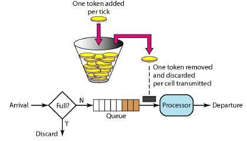

# 限流算法

date: 2019-5-15 22点54分49

## 计数器
简单的做法是维护一个单位时间内的 计数器，每次请求计数器加1，当单位时间内计数器累加到大于设定的阈值，则之后的请求都被拒绝，直到单位时间已经过去，再将 计数器 重置为零。
此方式有个弊端：如果在单位时间1s内允许100个请求，在10ms已经通过了100个请求，那后面的990ms，只能眼巴巴的把请求拒绝，我们把这种现象称为“突刺现象”。
常用的更平滑的限流算法有两种：漏桶算法 和 令牌桶算法。下面介绍下二者。

## 漏桶算法
漏桶算法思路很简单，水（请求）先进入到漏桶里，漏桶以一定的速度出水（接口有响应速率），
当水流入速度过大会直接溢出（访问频率超过接口响应速率），然后就拒绝请求，可以看出漏桶算法能强行限制数据的传输速率。

可见这里有两个变量，一个是桶的大小，支持流量突发增多时可以存多少的水（burst），另一个是水桶漏洞的大小（rate）。
因为漏桶的漏出速率是固定的参数，所以，即使网络中不存在资源冲突（没有发生拥塞），漏桶算法也不能使流突发（burst）到端口速率。
因此，漏桶算法对于存在突发特性的流量来说缺乏效率。

## 令牌桶算法
令牌桶算法 和漏桶算法 效果一样但方向相反的算法，更加容易理解。随着时间流逝，系统会按恒定 1/QPS 时间间隔（如果 QPS=100，则间隔是 10ms）往桶里加入 Token（想象和漏洞漏水相反，有个水龙头在不断的加水），如果桶已经满了就不再加了。
新请求来临时，会各自拿走一个 Token，如果没有 Token 可拿了就阻塞或者拒绝服务。

令牌桶的另外一个好处是可以方便的改变速度。一旦需要提高速率，则按需提高放入桶中的令牌的速率。
一般会定时（比如 100 毫秒）往桶中增加一定数量的令牌，有些变种算法则实时的计算应该增加的令牌的数量。